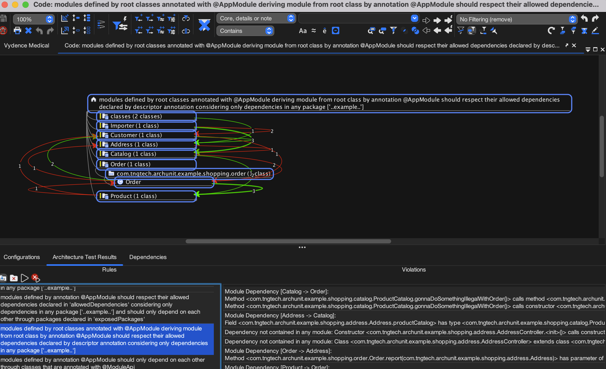

# Freeplane ArchUnit Extension

This project provides an extension for ArchUnit that allows displaying ArchUnit test results directly in Freeplane, if Freeplane is running and detects errors during the tests.

## Features

- Integration with Freeplane to visualize ArchUnit test results in real-time.
- Easy configuration through `archunit.properties` file.
- Default communication via port 6297, which can be customized.

## Getting Started

To incorporate this extension into your project, it's essential to add it to your test classpath. This can be achieved through various methods, including adding it as a dependency in your build system. Below, you'll find instructions for doing so using Gradle and Maven.

### Gradle

Add the following line to your `build.gradle` file under dependencies:

```groovy
testImplementation 'org.freeplane.archunit:freeplane-archunit-extension:0.0.1'
```

### Maven

For Maven projects, add the dependency snippet to your pom.xml:

```xml
<dependency>
  <groupId>org.freeplane.archunit</groupId>
  <artifactId>freeplane-archunit-extension</artifactId>
  <version>0.0.1</version>
  <scope>test</scope>
</dependency>
```

### Direct Test Class Path Configuration

For setups not utilizing Gradle or Maven, integrate the extension by directly including its JAR file in your test classpath. This method adapts to various build systems and environments, ensuring flexible integration.

## Extension Configuration

To enable the extension and configure the communication port, create an archunit.properties file in your project with the following content:

```properties
extension.freeplane-archunit-extension.enabled=true
extension.freeplane-archunit-extension.port=6297
```

Note: The default port is 6297, but you can change it in this file and in Freeplane's settings to match your setup.

## Viewing Test Results in Freeplane

Ensure Freeplane is running when executing your ArchUnit tests. For the extension to display the results, switch to Code Explorer mode by navigating through the menu: Maps -> Modes -> Code Explorer. Then, open the "Architecture Test Results" tab at the bottom of the interface. Activate listening on the designated port by clicking on the leftmost button in this tab. Once enabled, this setting will persist over Freeplane restarts until manually disabled. This allows for a more interactive debugging experience by automatically displaying test results in Freeplane if any errors are detected by the extension.

To view recorded violations, simply double-click on the violated rule listed in the table within the "Architecture Test Results" tab, or select the rule and press the "run" button. This action will display the details of the violations, enhancing your ability to analyze and address them directly from within Freeplane.

## Screenshots



## Contributing
Contributions are welcome! Feel free to submit pull requests or open issues to suggest improvements or report bugs.

## License

This project is licensed under the Apache 2.0 License - see the LICENSE file for details.

